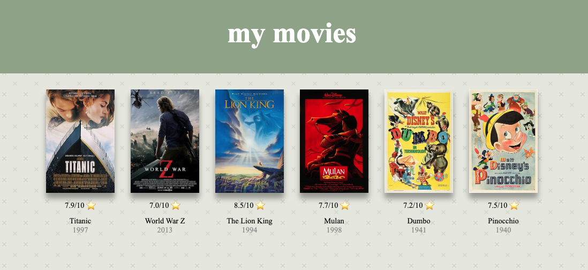

# *
MyMovieApp 🎥
* 
store all your favorite movies in one place!

## 
Purpose

MyMovieApp is in vast majority a CLI app. It allows a user to create their own file which stores information about their  
chosen movies:
* movie title
* release year
* rating
* imdbID 
* url to official poster

there also is an option to add a personal note. 
The user can add or delete a movie, add a personal note to it, generate a rating histogram of their movies or generate a simple website.

## 
The website

One of the features of the program is generating a simple html page which displays movie poster and related information.  
User can click on the poster and be redirected to said movie's imdb page.
Hovering over the poster will display user's personal note, if any was added.

## 
Set up

To set the app up, simply clone this repository and install all the dependencies specified in "requirements.txt".
This project uses www.omdbapi.com API, the page requires API_KEY to work.

After cloning a repository, create an .env file where you pass your personal API_KEY in this format:

> API_KEY='your_key_here'

## 
Usage

MyMoviesApp uses a command line argument to create and access specific user database. In order to start the program, in  the command line you need to pass a filename.
It is recommended to use your name followed by a file extension. Currently supported file extensions are .csv and .json.

Example:
>python3 main.py john_smith.csv

Once program is successfully initiated, a menu is displayed showing all the available option to the user:

Options 9 and 10 generate additional files.
Option 9 creates a histogram which is then stored in _data repository, option 10 creates an index.htm file which is stored in _static. Simply open the html file in your browser to see a webpage.

